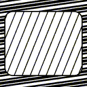
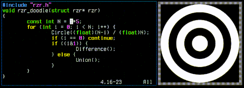

## Features
 - Small codebase, easy to drop-in: just copy `rzr.c` and `rzr.h` into your project, public domain/MIT.
 - Monochrome-only, 8-bit grayscale output.
 - Stack-based drawing:
   - Shapes (pushes 1): circles, polygons (concave).
   - Boolean operations (pops 2, pushes 1): union, difference, intersection.
 - Helper shapes: line, line pattern, arc, box, rounded box, segment, capsule, triangle, trapezoid and more.
   See the examples below; they were made with few calls.
 - Transforms: translate, rotate, scale.
 - Point queries: determines if a point lies inside or outside of your shape (useful for GUI mouseover stuff).
 - "MxN rendering": useful when you want to "stretch" the center of a render, like for UI frames, buttons, etc.
   (There's an example in the unit test, and it's explained better in `rzr.h`).
 - Depends on libc/libm, but doesn't `malloc()`; you provide the memory it uses.

## Examples





Generated with:
```
$ cc -DDEMOS -Wall -O2 rzr.c -o demo_rzr -lm && ./demo_rzr
Wrote _rzrdemo_sharp.png; render took 0.03639s
Wrote _rzrdemo_zoo.png; render took 0.01797s
animation of 75 frames took 0.2167s; 0.00289spf; 346.2fps; wrote _rzrdemo_anim.gif
```

The demo uses `stb_image_write.h` for writing PNGs and `msf_gif.h` for GIFs.

You can also try: `cc -DUNIT_TEST -Wall -O0 -g rzr.c -o test_rzr -lm && ./test_rzr`

## Doodling / Live Coding

See `rzr_doodle.py`, `doodle_demo.c` and the `RZR_DOODLE*` defines in `rzr.c`. It's a huge hack that (when it works)
allows you to see the results of an rzr render immediately after saving. Like OpenSCAD, but for vector graphics :-)


