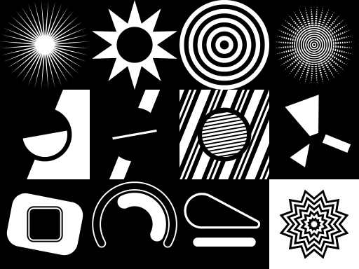
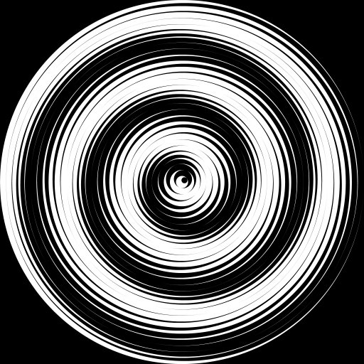

## Features
 - Small codebase, easy to drop-in: just copy `rzr.c` and `rzr.h` into your project, public domain/MIT.
 - Monochrome-only, 8-bit grayscale output
 - Stack-based drawing:
   - Shapes (pushes 1): circles, polygons (concave) (+helpers).
   - Boolean operations (pops 2, pushes 1): union, difference, intersection.
 - Transforms: translate, rotate, scale
 - Point queries" determines if a point lies inside or outside of your shape (useful for GUI mouseover stuff).
 - "MxN rendering": useful for stretched renders, like UI frames, buttons, etc.
 - Reasonably fast? Merges subpixel-scanline span lists into `memset()`'able pixel spans.
 - Depends on libc/libm, but doesn't `malloc()`; you provide the memory it uses.

## Examples

Generated with: `cc -DDEMOS -Wall -O0 -g rzr.c -o demo_rzr -lm && ./demo_rzr`.

The demo uses `stb_image_write.h` for writing PNGs and `msf_gif.h` for GIFs.

You can also try: `cc -DUNIT_TEST -Wall -O0 -g rzr.c -o test_rzr -lm && ./test_rzr`
